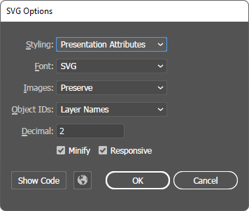

<p><a href="https://www.skia4delphi.org"></a></p>

#  SVG

## Rendering SVG

The code below shows how to load and render a SVG file into an ISkCanvas:

```pascal
uses
  Skia, Skia.FMX; // or Skia.Vcl

var
  LBitmap: TBitmap;
begin
  LBitmap := TBitmap.Create(100, 100);
  try
    LBitmap.SkiaDraw(
      procedure (const ACanvas: ISKCanvas)
      var
        LSvgBrush: TSkSvgBrush;
      begin
        LSvgBrush := TSkSvgBrush.Create;
        try
          LSvgBrush.Source := TFile.ReadAllText('Assets\Samples\gorilla.svg');
          LSvgBrush.Render(ACanvas, RectF(0, 0, LBitmap.Width, LBitmap.Height), 1);
        finally
          LSvgBrush.Free;
        end;
      end);
```

## Creating SVG

It is possible to create any type of SVG file using **Skia4Delphi** in an extremely simple way. Using the TSkSVGCanvas class, a SkCanvas is generated in which everything that you drawn using it, is transformed into an SVG file, even texts, gradients and effects. See an example:

```pascal
uses
  Skia;

type
  TSkDrawProc = reference to procedure(const ACanvas: ISkCanvas; const ADest: TRectF);

procedure CreateSVG(const AOutputFileName: string; const AWidth, AHeight: Integer; const ADrawProc: TSkDrawProc);
var
  LStream: TStream;
  LCanvas: ISkCanvas;
begin
  LStream := TFileStream.Create(AOutputFileName, fmCreate);
  try
    LCanvas := TSkSVGCanvas.Make(RectF(0, 0, AWidth, AHeight), LStream, [TSkSVGCanvasFlag.ConvertTextToPaths]);
    ADrawProc(LCanvas, RectF(0, 0, AWidth, AHeight));
    LCanvas := nil;
  finally
    LStream.Free;
  end;
end;
```

```pascal
CreateSVG('output.svg', 256, 256,
  procedure (const ACanvas: ISkCanvas; const ADest: TRectF)
  var
    LFont: ISkFont;
    LPaint: ISkPaint;
  begin
    LFont := TSkFont.Create(TSkTypeface.MakeFromFile('Assets\Samples\nunito-extrabold.ttf'), 23);
    LPaint := TSkPaint.Create;
    LPaint.Shader := TSkShader.MakeGradientLinear(PointF(0, 0), PointF(256, 145), $FFFF5F5F, $FF5B8DFE, TSkTileMode.Clamp);
 
    ACanvas.DrawSimpleText('"Each dream that you', 2, 25, LFont, LPaint);
    ACanvas.DrawSimpleText('leave behind is a part', 2, 55, LFont, LPaint);
    ACanvas.DrawSimpleText('of your future that will', 2, 85, LFont, LPaint);
    ACanvas.DrawSimpleText('no longer exist."', 2, 115, LFont, LPaint);
 
    LFont := TSkFont.Create(TSkTypeface.MakeFromFile('Assets\Samples\bonheur-royale-regular.ttf'), 28);
    LPaint.Shader := nil;
    LPaint.Color  := $FF5B8DFE;
    ACanvas.DrawSimpleText('(Steve Jobs)', 2, 150, LFont, LPaint);
  end);
```
This code results in the SVG file below:

<p></p>

  

## TSkSvg

**TSkSvg** is the control (VCL or FMX) to load and display SVG easily:

```pascal
var
  LSvg: TSkSvg;
begin
  LSvg := TSkSvg.Create(Self);
  LSvg.Svg.Source := TFile.ReadAllText('Assets\Samples\gorilla.svg');
  LSvg.Parent := Self;
end;
```

The example above results in the output below:

<p></p>

  

### SkSvg.Source property

Text property of SVG file content.

### SkSvg.OverrideColor property

When this property is Null (default value), the control will render the SVG in default color. But when this property have another value, the control will replace the SVG color to the `OverrideColor`. This is usefull in icons SVGs, for example.

### SkSvg.WrapMode property

Specifies whether and how to resize, replicate, and position the SVG draw inside the **TSkSvg** control. See the available options:

| TSkSvgWrapMode | Description                                                                                                                                                   |
|----------------|---------------------------------------------------------------------------------------------------------------------------------------------------------------|
| Default        | Keep SVG stretch defined in SVG file                                                                                                                          |
| Fit (Default)  | Stretches SVG into the destination rectangle, preserving aspect ratio                                                                                         |
| FitCrop        | Stretches SVG into the destination rectangle, preserving aspect ratio, but cropping the excess                                                                |
| Original       | Display the SVG with its original dimensions                                                                                                                  |
| OriginalCenter | Display the SVG with its original dimensions but centered                                                                                                     |
| Place          | Places the SVG inside the destination rectangle. If the SVG is greater than the destination rectangle then the SVG is scaled down with aspect ratio preserved |
| Stretch        | Stretch the SVG to fill the entire destination rectangle                                                                                                      |
| Tile           | Tile (multiply) the SVG to cover the entire destination rectangle                                                                                             |

  

## Limitations

### 1. No support for inner style element

**Skia4Delphi** does not support inner `<style>` element, only presentation attributes. Some vector graphics editors when saving/exporting the SVG file allow you to configure it to be saved/exported with presentation attributes only in styling options.

  

#### Way to fix

You can create or convert any SVG file so that it can be compatible with the library in different ways. The recommended way is to use **Adobe Illustrator**:

  1. Open in Adobe Illustrator the SVG file (or vector like EPS file);
  2. Click in File > Export > Export as...;
  3. Choose the file name output, and the SVG to file type and press OK;
  4. In SVG Options window, set Presentation Attributes and click in OK:  
    

  

### 2. No support for document type definition

**Skia4Delphi** does not support DTD `<!DOCTYPE ...>`.

#### Way to fix

When exported via **Adobe Illustrator** the DTD is removed, but it can be removed manually as well.

  

### 3. No support for inner symbol element

**Skia4Delphi** does not support inner `<symbol>` element.

  

## Free SVG sources

- [Bootstrap Icons](https://icons.getbootstrap.com/)
- [heroicons](https://heroicons.com/)
- [iconscout](https://iconscout.com/)
- [SVGRepo](https://svgrepo.com/)
