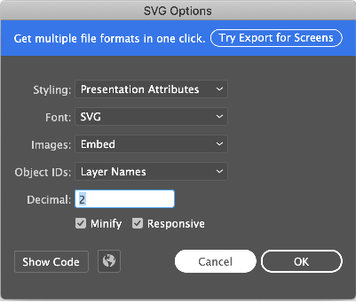

# SVG

## SVG in pure skia

The skia developed a way to load and render svgs with the class TSkSVGDOM. The code below shows how to load and render a svg into an ISkCanvas:

```pascal
var
  LBitmap: TBitmap;
begin
  LBitmap := TBitmap.Create(100, 100);
  try
    LBitmap.SkiaDraw(
      procedure (const ACanvas: ISKCanvas)
      var
        LStream: ISkStream;
        LDOM: ISkSVGDOM;
        LSvgRect, LFitDest: TRectF;
      begin
        LStream := TSkStreamAdapter.Create(TStringStream.Create(TFile.ReadAllText('Assets\Samples\gorilla.svg')), True);
        LDOM := TSkSVGDOM.Make(LStream);
        if Assigned(LDOM) then
        begin
          if LDOM.ContainerSize.IsZero then
            LDOM.ContainerSize := TSizeF.Create(LBitmap.Width, LBitmap.Height);
          LSvgRect := TRectF.Create(PointF(0, 0), LDOM.ContainerSize);
          LFitDest := LSvgRect.FitInto(RectF(0, 0, LBitmap.Width, LBitmap.Height));
          ACanvas.Translate(LFitDest.Left, LFitDest.Top);
          ACanvas.Scale(LFitDest.Width / LSvgRect.Width, LFitDest.Height / LSvgRect.Height);
          LDOM.Render(ACanvas);
        end;
      end);
```

Note that in the example above we use LDOM.ContainerSize to inform the final size of the svg we want to render when the LDOM.ContainerSize is zero. If this is not done, you have the risk of LDOM.Render giving access violation when the width and height are not explicit in the svg source (which is quite common). So always use LDOM.ContainerSize before rendering as the example above.

We showed above how to load and render a svg using pure skia, but as this functionality is very important, we developed a dedicated control to svg render, called TSkSvg, see below.


## TSkSvg

TSkSvg is the control to load and display svgs easily:

```pascal
var
  LSvg: TSkSvg;
begin
  LSvg := TSkSvg.Create(Self);
  LSvg.Svg.Source := TFile.ReadAllText('Assets\Samples\gorilla.svg');
  LSvg.Parent := Self;
end;
```

The **Assets/Samples/gorilla.svg** svg file results in the output below:


#### property Svg.Source

String property of svg file content.

#### property Svg.OverrideColor

When this property is Null (default value), the control will render the svg in default color. But when this property have another value, the control will replace the svg color to the Svg.OverrideColor. This is usefull in icons svgs, for example.


## Limitations

Unfortunately, the skia rendering of SVG has an important limitation:

- Does not support style element and style attribute (see the workaround in next topic, [Considerations](#considerations))
- Does not support animated SVG


## Considerations

As the skia doesn't support svg style yet, you should disable the generation of these styles whenever you generate your svg. For example, in Adobe Illustrator when you export your vector as svg, you need to set the follow cofigurations:

 - In Styling: choose **Presentation Attributes** instead of Inline CSS because CSS is not fully supported.

 


## Known issues

 - Problems in MacOS with language with decimal separator different than dot. We are investigating the solution.
