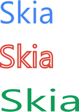
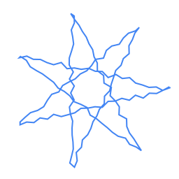
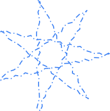
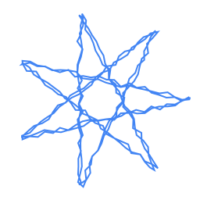
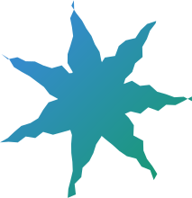
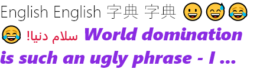

<p><a href="https://www.skia4delphi.org"></a></p>

# Usage

The code below is common code among all the examples in this document:

```pascal
uses
  Skia;

type
  TSkDrawExampleProc = reference to procedure(const ACanvas: ISkCanvas; const ADest: TRectF);

procedure DrawExample(const AWidth, AHeight: Integer; const ADrawProc: TSkDrawExampleProc);
var
  LSurface: ISkSurface;
begin
  LSurface := TSkSurface.MakeRaster(AWidth, AHeight);
  LSurface.Canvas.Clear(TAlphaColors.Null);
  ADrawProc(LSurface.Canvas, RectF(0, 0, AWidth, AHeight));
  LSurface.MakeImageSnapshot.EncodeToFile('output.png');
end;
```

  

## Basic Usage

With **Skia4Delphi** it is possible to make various types of drawings easily. Some examples are:

- Shapes

  ```pascal
  DrawExample(256, 256,
    procedure (const ACanvas: ISkCanvas; const ADest: TRectF)
    var
      LOval: ISkRoundRect;
      LPaint: ISkPaint;
      LRect: TRectF;
    begin
      LPaint := TSkPaint.Create;
      LPaint.AntiAlias := True;

      LPaint.Color := $FF4285F4;
      LRect := TRectF.Create(PointF(10, 10), 100, 160);
      ACanvas.DrawRect(LRect, LPaint);

      LOval := TSkRoundRect.Create;
      LOval.SetOval(LRect);
      LOval.Offset(40, 80);
      LPaint.Color := $FFDB4437;
      ACanvas.DrawRoundRect(LOval, LPaint);

      LPaint.Color := $FF0F9D58;
      ACanvas.DrawCircle(180, 50, 25, LPaint);

      LRect.Offset(80, 50);
      LPaint.Color := $FFF4B400;
      LPaint.Style := TSkPaintStyle.Stroke;
      LPaint.StrokeWidth := 4;
      ACanvas.DrawRoundRect(LRect, 10, 10, LPaint);
    end);
  ```

  This code results in the output below:

  <p></p>

- Bézier Curves

  ```pascal
  DrawExample(256, 256,
    procedure (const ACanvas: ISkCanvas; const ADest: TRectF)
    var
      LPaint: ISkPaint;
      LPath: ISkPath;
      LPathBuilder: ISkPathBuilder;
    begin
      LPaint := TSkPaint.Create(TSkPaintStyle.Stroke);
      LPaint.StrokeWidth := 8;
      LPaint.Color := $FF4285F4;
      LPaint.AntiAlias := True;
      LPaint.StrokeCap := TSkStrokeCap.Round;

      LPathBuilder := TSkPathBuilder.Create;
      LPathBuilder.MoveTo(10, 10);
      LPathBuilder.QuadTo(256, 64, 128, 128);
      LPathBuilder.QuadTo(10, 192, 250, 250);
      LPath := LPathBuilder.Detach;
      ACanvas.DrawPath(LPath, LPaint);
    end);
  ```

  This code results in the output below:

  <p></p>

- Translations and Rotations

  ```pascal
  DrawExample(256, 256,
    procedure (const ACanvas: ISkCanvas; const ADest: TRectF)
    var
      LPaint: ISkPaint;
      LRect: TRectF;
    begin
      ACanvas.Translate(128, 0);
      ACanvas.Rotate(60);
      LRect := RectF(0, 0, 200, 100);

      LPaint := TSkPaint.Create;
      LPaint.AntiAlias := True;
      LPaint.Color := $FF4285F4;
      ACanvas.DrawRect(LRect, LPaint);

      ACanvas.Rotate(20);
      LPaint.Color := $FFDB4437;
      ACanvas.DrawRect(LRect, LPaint);
    end);
  ```

  This code results in the output below:

  <p></p>

- Text Rendering

  ```pascal
  DrawExample(256, 256,
    procedure (const ACanvas: ISkCanvas; const ADest: TRectF)
    var
      LBlob1: ISkTextBlob;
      LBlob2: ISkTextBlob;
      LFont1: ISkFont;
      LFont2: ISkFont;
      LPaint1: ISkPaint;
      LPaint2: ISkPaint;
      LPaint3: ISkPaint;
      LTypeface: ISkTypeface;
    begin
      LTypeface := TSkTypeface.MakeFromName('Monospace', TSkFontStyle.Normal);
      LFont1 := TSkFont.Create(LTypeface, 64, 1);
      LFont2 := TSkFont.Create(LTypeface, 64, 1.5);
      LFont1.Edging := TSkFontEdging.AntiAlias;
      LFont2.Edging := TSkFontEdging.AntiAlias;

      LBlob1 := TSkTextBlob.MakeFromText('Skia', LFont1);
      LBlob2 := TSkTextBlob.MakeFromText('Skia', LFont2);

      LPaint1 := TSkPaint.Create;
      LPaint1.AntiAlias := True;
      LPaint1.SetARGB($FF, $42, $85, $F4);

      LPaint2 := TSkPaint.Create(TSkPaintStyle.Stroke);
      LPaint2.AntiAlias := True;
      LPaint2.SetARGB($FF, $DB, $44, $37);
      LPaint2.StrokeWidth := 3;

      LPaint3 := TSkPaint.Create;
      LPaint3.AntiAlias := True;
      LPaint3.SetARGB($FF, $0F, $9D, $58);

      ACanvas.DrawTextBlob(LBlob1, 20, 64, LPaint1);
      ACanvas.DrawSimpleText('Skia', 20, 154, LFont1, LPaint2);
      ACanvas.DrawTextBlob(LBlob2, 20, 244, LPaint3);
    end);
  ```

  This code results in the output below:

  <p></p>

- Discrete Path Effects

  ```pascal
  function StarPath: ISkPath;
  const
    C = 128.0;
    R = 115.2;
  var
    I: Integer;
    A: Single;
    LPathBuilder: ISkPathBuilder;
  begin
    LPathBuilder := TSkPathBuilder.Create;
    LPathBuilder.MoveTo(C + R, C);
    for I := 1 to 7 do
    begin
      A := 2.6927937 * I;
      LPathBuilder.LineTo(C + R * Cos(A), C + R * Sin(A));
    end;
    Result := LPathBuilder.Detach;
  end;
  ```

  ```pascal
  DrawExample(256, 256,
    procedure (const ACanvas: ISkCanvas; const ADest: TRectF)
    var
      LPaint: ISkPaint;
    begin
      LPaint := TSkPaint.Create(TSkPaintStyle.Stroke);
      LPaint.PathEffect := TSkPathEffect.MakeDiscrete(10, 4);
      LPaint.StrokeWidth := 2;
      LPaint.AntiAlias := True;
      LPaint.Color := $FF4285F4;
      ACanvas.DrawPath(StarPath, LPaint);
    end);
  ```

  This code results in the output below:

  <p></p>

- Composed Path Effects

  ```pascal
  DrawExample(256, 256,
    procedure (const ACanvas: ISkCanvas; const ADest: TRectF)
    var
      LPaint: ISkPaint;
      LDashPathEffect: ISkPathEffect;
      LDiscretePathEffect: ISkPathEffect;
    begin
      LDashPathEffect := TSkPathEffect.MakeDash([10, 5, 2, 5], 0);
      LDiscretePathEffect := TSkPathEffect.MakeDiscrete(10, 4);
      LPaint := TSkPaint.Create(TSkPaintStyle.Stroke);
      LPaint.PathEffect := TSkPathEffect.MakeCompose(LDashPathEffect, LDiscretePathEffect);
      LPaint.StrokeWidth := 2;
      LPaint.AntiAlias := True;
      LPaint.Color := $FF4285F4;
      ACanvas.DrawPath(StarPath, LPaint);
    end);
  ```

  This code results in the output below:

  <p></p>

- Sum Path Effects

  ```pascal
  DrawExample(256, 256,
    procedure (const ACanvas: ISkCanvas; const ADest: TRectF)
    var
      LPaint: ISkPaint;
      LDashPathEffect1: ISkPathEffect;
      LDashPathEffect2: ISkPathEffect;
    begin
      LDashPathEffect1 := TSkPathEffect.MakeDiscrete(10, 4);
      LDashPathEffect2 := TSkPathEffect.MakeDiscrete(10, 4, 1245);
      LPaint := TSkPaint.Create(TSkPaintStyle.Stroke);
      LPaint.PathEffect := TSkPathEffect.MakeSum(LDashPathEffect1, LDashPathEffect2);
      LPaint.StrokeWidth := 2;
      LPaint.AntiAlias := True;
      LPaint.Color := $FF4285F4;
      ACanvas.DrawPath(StarPath, LPaint);
    end);
  ```

  This code results in the output below:

  <p></p>

- Shaders

  ```pascal
  DrawExample(256, 256,
    procedure (const ACanvas: ISkCanvas; const ADest: TRectF)
    var
      LPaint: ISkPaint;
    begin
      LPaint := TSkPaint.Create;
      LPaint.PathEffect := TSkPathEffect.MakeDiscrete(10, 4);
      LPaint.Shader := TSkShader.MakeGradientLinear(PointF(0, 0), PointF(256, 256), $FF4285F4, $FF0F9D58, TSkTileMode.Clamp);
      LPaint.AntiAlias := True;
      ACanvas.DrawPath(StarPath, LPaint);
    end);
  ```

  This code results in the output below:

  <p></p>

  

## Text Right-to-Left

There are a couple of languages that the direction of the text is from right to left such as Persian, Arabic, Hebrew, and more. With **Skia4Delphi** it is possible to render Right-to-Left. The example below demonstrates how to render a Persian sentence using a text-shaping engine:

```pascal
DrawExample(256, 256,
  procedure (const ACanvas: ISkCanvas; const ADest: TRectF)
  var
    LBlob: ISkTextBlob;
    LFont: ISkFont;
    LPaint: ISkPaint;
    LShaper: ISkShaper;
  begin
    LFont := TSkFont.Create(TSkTypeface.MakeDefault, 55, 1);
    LShaper := TSkShaper.Create;
    LBlob := LShaper.Shape('سلام دنیا!', LFont, False, MaxSingle);

    LPaint := TSkPaint.Create;
    LPaint.AntiAlias := True;
    LPaint.Color := TAlphaColors.Tomato;

    ACanvas.DrawTextBlob(LBlob, 0, 0, LPaint);
  end);
```

This code results in the output below:

<p></p>

  

## Custom fonts

With **Skia4Delphi** it is possible to use custom fonts easily, from the file, without the need to install it on the operating system, regardless of the platform. The example below will draw using two custom fonts:

```pascal
DrawExample(256, 256,
  procedure (const ACanvas: ISkCanvas; const ADest: TRectF)
  var
    LFont: ISkFont;
    LPaint: ISkPaint;
  begin
    LFont := TSkFont.Create(TSkTypeface.MakeFromFile('Assets\Samples\nunito-extrabold.ttf'), 23);
    LPaint := TSkPaint.Create;
    LPaint.Shader := TSkShader.MakeGradientLinear(PointF(0, 0), PointF(256, 145), $FFFF5F5F, $FF5B8DFE, TSkTileMode.Clamp);

    ACanvas.DrawSimpleText('"Each dream that you', 2, 25, LFont, LPaint);
    ACanvas.DrawSimpleText('leave behind is a part', 2, 55, LFont, LPaint);
    ACanvas.DrawSimpleText('of your future that will', 2, 85, LFont, LPaint);
    ACanvas.DrawSimpleText('no longer exist."', 2, 115, LFont, LPaint);

    LFont := TSkFont.Create(TSkTypeface.MakeFromFile('Assets\Samples\bonheur-royale-regular.ttf'), 28);
    LPaint.Shader := nil;
    LPaint.Color  := $FF5B8DFE;
    ACanvas.DrawSimpleText('(Steve Jobs)', 2, 150, LFont, LPaint);
  end);
```
This code results in the output below:

<p></p>

  

## Paragraph

With **Skia4Delphi** it is possible to render texts with multiple styles, fonts, sizes, and with many settings like the maximum number of lines. The example below demonstrates how to render with SkParagraph:

```pascal
DrawExample(440, 440,
  procedure (const ACanvas: ISkCanvas; const ADest: TRectF)
  var
    LParagraph: ISkParagraph;
    LBuilder: ISkParagraphBuilder;
    LTextStyle: ISkTextStyle;
    LParagraphStyle: ISkParagraphStyle;
  begin
    LParagraphStyle := TSkParagraphStyle.Create;
    LParagraphStyle.MaxLines := 3;
    LParagraphStyle.Ellipsis := '...';
    LBuilder := TSkParagraphBuilder.Create(LParagraphStyle);

    LTextStyle := TSkTextStyle.Create;
    LTextStyle.Color := TAlphaColors.Black;
    LTextStyle.SetFontSize(28);
    LTextStyle.SetFontStyle(TSkFontStyle.Create(TSkFontWeight.Light, TSkFontWidth.Normal, TSkFontSlant.Upright));
    LBuilder.PushStyle(LTextStyle);
    LBuilder.AddText('English English 字典 字典 😀😅😂😂');

    LTextStyle := TSkTextStyle.Create;
    LTextStyle.Color := TAlphaColors.Crimson;
    LTextStyle.SetFontSize(22);
    LTextStyle.SetFontStyle(TSkFontStyle.Create(TSkFontWeight.SemiBold, TSkFontWidth.Normal, TSkFontSlant.Upright));
    LBuilder.PushStyle(LTextStyle);
    LBuilder.AddText(' !سلام دنیا');

    LTextStyle := TSkTextStyle.Create;
    LTextStyle.Color := TAlphaColors.Blueviolet;
    LTextStyle.SetFontSize(30);
    LTextStyle.SetFontStyle(TSkFontStyle.Create(TSkFontWeight.ExtraBold, TSkFontWidth.Normal, TSkFontSlant.Italic));
    LBuilder.PushStyle(LTextStyle);
    LBuilder.AddText(' World domination is such an ugly phrase - I prefer to call it world optimisation.');

    LParagraph := LBuilder.Build;
    LParagraph.Layout(ADest.Width);
    LParagraph.Paint(ACanvas, 0, 0);
  end);
```

This code results in the output below:



  

## PDF

With **Skia4Delphi** it is possible to create PDF documents and draw anything on them, from text to images. The example below demonstrates how to create an PDF document and draw an SVG inside it:

```pascal
var
  LCanvas: ISkCanvas;
  LDocument: ISkDocument;
  LDocumentStream: TStream;
  LSVGDOM: ISkSVGDOM;
  LSize: TSizeF;
begin
  LSVGDOM := TSkSVGDOM.MakeFromFile('Assets\Samples\lion.svg');
  LSize := TSizeF.Create(600, 600);
  LSVGDOM.SetContainerSize(LSize);

  LDocumentStream := TFileStream.Create('output.pdf', fmCreate);
  try
    LDocument := TSkDocument.MakePDF(LDocumentStream);
    try
      LCanvas := LDocument.BeginPage(LSize.Width, LSize.Height);
      try
        LSVGDOM.Render(LCanvas);
      finally
        LDocument.EndPage;
      end;
    finally
      LDocument.Close;
    end;
  finally
    LDocumentStream.Free;
  end;
end;
```

This code results in the output below:

<p></p>

  

## Codecs

The **Skia4Delphi** library supports many image formats. See below the list:

- Supported formats for decoding

  | Image Format                   | Extensions  |
  |--------------------------------|-------------|
  | Bitmap                         | .bmp        |
  | GIF                            | .gif        |
  | Icon                           | .ico        |
  | JPEG                           | .jpg, .jpeg |
  | PNG                            | .png        |
  | Raw Adobe DNG Digital Negative | .dng        |
  | Raw Canon                      | .cr2        |
  | Raw Fujifilm RAF               | .raf        |
  | Raw Nikon                      | .nef, .nrw  |
  | Raw Olympus ORF                | .orf        |
  | Raw Panasonic                  | .rw2        |
  | Raw Pentax PEF                 | .pef        |
  | Raw Samsung SRW                | .srw        |
  | Raw Sony                       | .arw        |
  | WBMP                           | .wbmp       |
  | WebP                           | .webp       |

- Supported formats for encoding

  | Image Format | Extensions  |
  |--------------|-------------|
  | JPEG         | .jpg, .jpeg |
  | PNG          | .png        |
  | WebP         | .webp       |

  

### About WebP

WebP is a modern image format that provides superior lossless and lossy compression for images. WebP lossless images are 26% smaller in size compared to PNGs. WebP lossy images are 25-34% smaller than comparable JPEG images at equivalent quality.

The example below demonstrates how to encoder to WebP format:

```pascal
var
  LImage: ISkImage;
begin
  LImage := TSkImage.MakeFromEncodedFile('Assets\Samples\kung-fu-panda.png');
  LImage.EncodeToFile('output.webp', TSkEncodedImageFormat.WEBP, 80);
  LImage.EncodeToFile('output.jpg', TSkEncodedImageFormat.JPEG, 80);
end;
```

This code results in the output below:

<p></p>

| Format             | Size    |
|--------------------|---------|
| Png (100% quality) |  512 KB |
| Jpeg (80% quality) |   65 KB |
| WebP (80% quality) |   51 KB |
