[](http://docwiki.embarcadero.com/PlatformStatus/en/Main_Page) [](http://docwiki.embarcadero.com/PlatformStatus/en/Main_Page)


#  

**[Skia4Delphi](https://skia4delphi.org)** is a cross-platform 2D graphics API for Delphi based on Google's Skia Graphics Library ([skia.org](https://skia.org/)).

Google's Skia Graphics Library serves as the graphics engine for Google Chrome and Chrome OS, Android, Flutter, Xamarin, Mozilla Firefox and Firefox OS, and many other products.


## Motivation

Skia is a great open source library for drawing 2D Text, Geometries, Images, focused on accurate, high quality and high performance rendering, which provides common APIs that work across a variety of hardware and software platforms.


## Summary

* [Installation](#installation)
* [Enabling your project](#enabling-your-project)
* [Documentation](#documentation)
* [Basic Usage](#basic-usage)
* [Text RTL](#text-rtl)
* [Custom Fonts](#custom-fonts)
* [Paragraph](#paragraph)
* [PDF](#pdf)
* [WebP](#webp)
* [Controls](#controls)
  * [PaintBox](#paintbox)
  * [SVG](#svg)
  * [Lottie (animation player)](#lottie-animation-player)
* [TBitmap integration](#tbitmap-integration)
* [Debug](#debug)
* [Limitations](#limitations)
* [Version](#version)
* [Build](./Documents/BUILD.md)


## Installation

There are two recommended ways to install the library:

- Install Skia4Delphi via GetIt (RAD Studio > Tools > GetIt Package Manager...)

  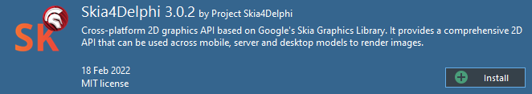

- Or just download and run our setup in [releases page](https://github.com/viniciusfbb/skia4delphi/releases)

  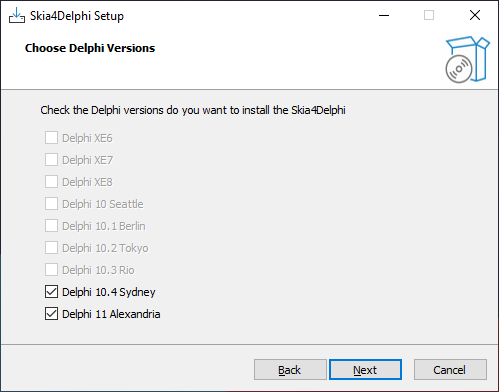 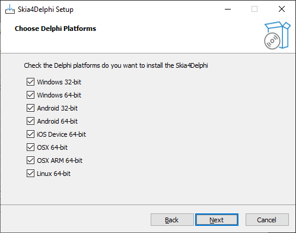

But, if you want, you can also do the manual installation (although it's a lot of work). See the full [documentation of installation](Documents/INSTALLATION.md).


## Enabling your project

After install the Skia4Delphi, you need to enable your project to be able to run with the skia library. In your IDE, just right click in your application project and "Enable Skia".

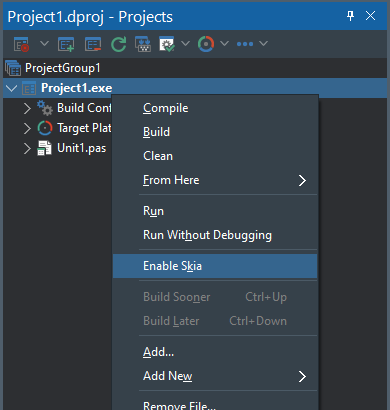

Skipping this step, your application startup will get a "runtime error".

Note: You don't need to do this step in package projects that use our units. This step is exclusive for application projects.


## Documentation

The APIs are very similar to Skia's, few methods and functions have been renamed for readability, so the [Skia documentation](https://skia.org/docs/) can be used.
Note: Some APIs were not exposed, some because they are deprecated.


## Basic Usage

The code below is common code among all the examples in this section:

```pascal
var
  LImage: ISkImage;
  LSurface: ISkSurface;
begin
  LSurface := TSkSurface.MakeRaster(256, 256);
  Draw(LSurface.Canvas);
  LImage := LSurface.MakeImageSnapshot;
  TFile.WriteAllBytes('output.png', LImage.EncodeToBytes(TSkEncodedImageFormat.PNG));
end;
```

### Shapes

```pascal
procedure Draw(const ACanvas: ISkCanvas);
var
  LOval: ISkRoundRect;
  LPaint: ISkPaint;
  LRect: TRectF;
begin
  ACanvas.Clear(TAlphaColors.Null);

  LPaint := TSkPaint.Create;
  LPaint.Style := TSkPaintStyle.Fill;
  LPaint.AntiAlias := True;
  LPaint.StrokeWidth := 4;
  LPaint.Color := $FF4285F4;

  LRect := TRectF.Create(TPointF.Create(10, 10), 100, 160);
  ACanvas.DrawRect(LRect, LPaint);

  LOval := TSkRoundRect.Create;
  LOval.SetOval(LRect);
  LOval.Offset(40, 80);
  LPaint.Color := $FFDB4437;
  ACanvas.DrawRoundRect(LOval, LPaint);

  LPaint.Color := $FF0F9D58;
  ACanvas.DrawCircle(180, 50, 25, LPaint);

  LRect.Offset(80, 50);
  LPaint.Color := $FFF4B400;
  LPaint.Style := TSkPaintStyle.Stroke;
  ACanvas.DrawRoundRect(LRect, 10, 10, LPaint);
end;
```

This code results in the output below:


### Bézier Curves

```pascal
procedure Draw(const ACanvas: ISkCanvas);
var
  LPaint: ISkPaint;
  LPath: ISkPath;
  LPathBuilder: ISkPathBuilder;
begin
  ACanvas.Clear(TAlphaColors.Null);

  LPaint := TSkPaint.Create;
  LPaint.Style := TSkPaintStyle.Stroke;
  LPaint.StrokeWidth := 8;
  LPaint.Color := $FF4285F4;
  LPaint.AntiAlias := True;
  LPaint.StrokeCap := TSkStrokeCap.Round;

  LPathBuilder := TSkPathBuilder.Create;
  LPathBuilder.MoveTo(10, 10);
  LPathBuilder.QuadTo(256, 64, 128, 128);
  LPathBuilder.QuadTo(10, 192, 250, 250);
  LPath := LPathBuilder.Detach;
  ACanvas.DrawPath(LPath, LPaint);
end;
```

This code results in the output below:

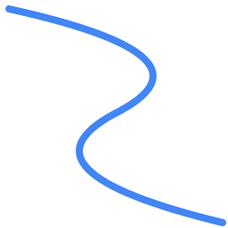

### Translations and Rotations

```pascal
procedure Draw(const ACanvas: ISkCanvas);
var
  LPaint: ISkPaint;
  LRect: TRectF;
begin
  ACanvas.Clear(TAlphaColors.Null);

  ACanvas.Translate(128, 0);
  ACanvas.Rotate(60);
  LRect := TRectF.Create(TPointF.Create(0, 0), 200, 100);

  LPaint := TSkPaint.Create;
  LPaint.AntiAlias := True;
  LPaint.Color := $FF4285F4;
  ACanvas.DrawRect(LRect, LPaint);

  ACanvas.Rotate(20);
  LPaint.Color := $FFDB4437;
  ACanvas.DrawRect(LRect, LPaint);
end;
```

This code results in the output below:

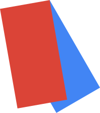

### Text Rendering

```pascal
procedure Draw(const ACanvas: ISkCanvas);
var
  LBlob1: ISkTextBlob;
  LBlob2: ISkTextBlob;
  LFont1: ISkFont;
  LFont2: ISkFont;
  LPaint1: ISkPaint;
  LPaint2: ISkPaint;
  LPaint3: ISkPaint;
  LTypeface: ISkTypeface;
begin
  LTypeface := TSkTypeface.MakeFromName('Monospace', TSkFontStyle.Normal);
  LFont1 := TSkFont.Create(LTypeface, 64, 1);
  LFont2 := TSkFont.Create(LTypeface, 64, 1.5);
  LFont1.Edging := TSkFontEdging.AntiAlias;
  LFont2.Edging := TSkFontEdging.AntiAlias;

  LBlob1 := TSkTextBlob.Make('Skia', LFont1);
  LBlob2 := TSkTextBlob.Make('Skia', LFont2);


  LPaint1 := TSkPaint.Create;
  LPaint1.AntiAlias := True;
  LPaint1.SetARGB($FF, $42, $85, $F4);

  LPaint2 := TSkPaint.Create;
  LPaint2.AntiAlias := True;
  LPaint2.SetARGB($FF, $DB, $44, $37);
  LPaint2.Style := TSkPaintStyle.Stroke;
  LPaint2.StrokeWidth := 3;

  LPaint3 := TSkPaint.Create;
  LPaint3.AntiAlias := True;
  LPaint3.SetARGB($FF, $0F, $9D, $58);

  ACanvas.Clear(TAlphaColors.White);
  ACanvas.DrawTextBlob(LBlob1, 20, 64, LPaint1);
  ACanvas.DrawSimpleText('Skia', 20, 154, LFont1, LPaint2);
  ACanvas.DrawTextBlob(LBlob2, 20, 244, LPaint3);
end;
```

This code results in the output below:

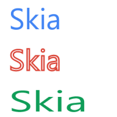

### Discrete Path Effects

```pascal
function Star: ISkPath;
var
  I: Integer;
  LA: Single;
  LC: Single;
  LPathBuilder: ISkPathBuilder;
  LR: Single;
begin
  LR := 115.2;
  LC := 128.0;
  LPathBuilder := TSkPathBuilder.Create;
  LPathBuilder.MoveTo(LC + LR, LC);
  for I := 1 to 7 do
  begin
    LA := 2.6927937 * I;
    LPathBuilder.LineTo(LC + LR * Cos(LA), LC + LR * Sin(LA));
  end;
  Result := LPathBuilder.Detach;
end;

procedure Draw(const ACanvas: ISkCanvas);
var
  LPaint: ISkPaint;
  LPath: ISkPath;
begin
  LPaint := TSkPaint.Create;
  LPaint.PathEffect := TSkPathEffect.MakeDiscrete(10, 4);
  LPaint.Style := TSkPaintStyle.Stroke;
  LPaint.StrokeWidth := 2;
  LPaint.AntiAlias := True;
  LPaint.Color := $FF4285F4;
  ACanvas.Clear(TAlphaColors.White);
  LPath := Star;
  ACanvas.DrawPath(LPath, LPaint);
end;
```

This code results in the output below:

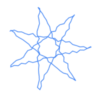

### Composed Path Effects

```pascal
function Star: ISkPath;
var
  I: Integer;
  LA: Single;
  LC: Single;
  LPathBuilder: ISkPathBuilder;
  LR: Single;
begin
  LR := 115.2;
  LC := 128.0;
  LPathBuilder := TSkPathBuilder.Create;
  LPathBuilder.MoveTo(LC + LR, LC);
  for I := 1 to 7 do
  begin
    LA := 2.6927937 * I;
    LPathBuilder.LineTo(LC + LR * Cos(LA), LC + LR * Sin(LA));
  end;
  Result := LPathBuilder.Detach;
end;

procedure Draw(const ACanvas: ISkCanvas);
var
  LPaint: ISkPaint;
  LPath: ISkPath;
  LIntervals: TArray<Single>;
  LDashPathEffect: ISkPathEffect;
  LDiscretePathEffect: ISkPathEffect;
begin
  LIntervals := [10, 5, 2, 5];
  LDashPathEffect := TSkPathEffect.MakeDash(LIntervals, 0);
  LDiscretePathEffect := TSkPathEffect.MakeDiscrete(10, 4);
  LPaint := TSkPaint.Create;
  LPaint.PathEffect := TSkPathEffect.MakeCompose(LDashPathEffect, LDiscretePathEffect);
  LPaint.Style := TSkPaintStyle.Stroke;
  LPaint.StrokeWidth := 2;
  LPaint.AntiAlias := True;
  LPaint.Color := $FF4285F4;
  ACanvas.Clear(TAlphaColors.White);
  LPath := Star;
  ACanvas.DrawPath(LPath, LPaint);
end;
```

This code results in the output below:

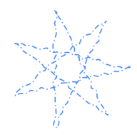

### Sum Path Effects

```pascal
function Star: ISkPath;
var
  I: Integer;
  LA: Single;
  LC: Single;
  LPathBuilder: ISkPathBuilder;
  LR: Single;
begin
  LR := 115.2;
  LC := 128.0;
  LPathBuilder := TSkPathBuilder.Create;
  LPathBuilder.MoveTo(LC + LR, LC);
  for I := 1 to 7 do
  begin
    LA := 2.6927937 * I;
    LPathBuilder.LineTo(LC + LR * Cos(LA), LC + LR * Sin(LA));
  end;
  Result := LPathBuilder.Detach;
end;

procedure Draw(const ACanvas: ISkCanvas);
var
  LPaint: ISkPaint;
  LPath: ISkPath;
  LIntervals: TArray<Single>;
  LDashPathEffect1: ISkPathEffect;
  LDashPathEffect2: ISkPathEffect;
begin
  LIntervals := [10, 5, 2, 5];
  LDashPathEffect1 := TSkPathEffect.MakeDiscrete(10, 4);
  LDashPathEffect2 := TSkPathEffect.MakeDiscrete(10, 4, 1245);
  LPaint := TSkPaint.Create;
  LPaint.PathEffect := TSkPathEffect.MakeSum(LDashPathEffect1, LDashPathEffect2);
  LPaint.Style := TSkPaintStyle.Stroke;
  LPaint.StrokeWidth := 2;
  LPaint.AntiAlias := True;
  LPaint.Color := $FF4285F4;
  ACanvas.Clear(TAlphaColors.White);
  LPath := Star;
  ACanvas.DrawPath(LPath, LPaint);
end;
```

This code results in the output below:

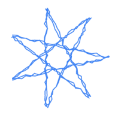

### Shaders

```pascal
function Star: ISkPath;
var
  I: Integer;
  LA: Single;
  LC: Single;
  LPathBuilder: ISkPathBuilder;
  LR: Single;
  LR2: Single;
begin
  LR := 60;
  LC := 128.0;
  LPathBuilder := TSkPathBuilder.Create;
  LPathBuilder.MoveTo(LC + LR, LC);
  for I := 1 to 14 do
  begin
    LA := 0.44879895 * I;
    LR2 := LR + LR * (I mod 2);
    LPathBuilder.LineTo(LC + LR2 * Cos(LA), LC + LR2 * Sin(LA));
  end;
  Result := LPathBuilder.Detach;
end;

procedure Draw(const ACanvas: ISkCanvas);
var
  LPaint: ISkPaint;
  LPath: ISkPath;
begin
  LPaint := TSkPaint.Create;
  LPaint.PathEffect := TSkPathEffect.MakeDiscrete(10, 4);
  LPaint.Shader := TSkShader.MakeGradientLinear(TPointF.Create(0, 0), TPointF.Create(256, 256), [$ff4285F4, $ff0F9D58], TSkTileMode.Clamp);
  LPaint.AntiAlias := True;
  ACanvas.Clear(TAlphaColors.White);
  LPath := Star;
  ACanvas.DrawPath(LPath, LPaint);
end;
```

This code results in the output below:

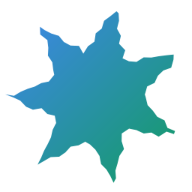


## Text RTL

The example below demonstrates how to render a Persian sentence using a text-shaping engine:

```pascal
procedure Draw(const ACanvas: ISkCanvas);
var
  LBlob: ISkTextBlob;
  LFont: ISkFont;
  LPaint: ISkPaint;
  LRunHandler: ISkTextBlobBuilderRunHandler;
  LShaper: ISkShaper;
  LText: string;
begin
  ACanvas.Clear(TAlphaColors.Null);
  LFont := TSkFont.Create(TSkTypeface.MakeDefault, 35, 1);
  LText := 'سلام دنیا!';

  LRunHandler := TSkTextBlobBuilderRunHandler.Create(LText, TPointF.Create(0, 0));
  LShaper := TSkShaper.Create;
  LShaper.Shape(LText, LFont, True, MaxSingle, LRunHandler);
  LBlob := LRunHandler.Detach;

  LPaint := TSkPaint.Create;
  LPaint.AntiAlias := True;
  LPaint.Color := TAlphaColors.Tomato;

  ACanvas.DrawTextBlob(LBlob, 0, 0, LPaint);
end;
```

This code results in the output below:


## Custom Fonts

With skia, you can easily use custom fonts in your texts, without having to install fonts, just have the ttf file. You will find an example of how to use custom font in our sample. See the result of the sample using 2 custom fonts:

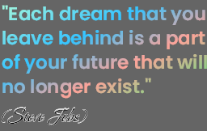


# Paragraph

With the skia SkParagraph, you can render texts with multiple styles, fonts, sizes, and with many settings like the maximum number of lines. The example below demonstrates how to render with SkParagraph:

```pascal
var
  LBitmap: TBitmap;
begin
  LBitmap := TBitmap.Create(440, 440);
  try
    LBitmap.SkiaDraw(
      procedure (const ACanvas: ISkCanvas)
      var
        LParagraph: ISkParagraph;
        LBuilder: ISkParagraphBuilder;
        LTextStyle: ISkTextStyle;
        LParagraphStyle: ISkParagraphStyle;
      begin
        LParagraphStyle := TSkParagraphStyle.Create;
        LParagraphStyle.TurnHintingOff;
        LParagraphStyle.MaxLines := 3;
        LParagraphStyle.Ellipsis := '...';
        LBuilder := TSkParagraphBuilder.Create(LParagraphStyle);

        LTextStyle := TSkTextStyle.Create;
        LTextStyle.Color := TAlphaColors.Black;
        LTextStyle.SetFontSize(28);
        LTextStyle.SetFontStyle(TSkFontStyle.Create(TSkFontWeight.Light, TSkFontWidth.Normal, TSkFontSlant.Upright));
        LBuilder.PushStyle(LTextStyle);
        LBuilder.AddText('English English 字典 字典 😀😅😂😂');

        LTextStyle := TSkTextStyle.Create;
        LTextStyle.Color := TAlphaColors.Crimson;
        LTextStyle.SetFontSize(22);
        LTextStyle.SetFontStyle(TSkFontStyle.Create(TSkFontWeight.SemiBold, TSkFontWidth.Normal, TSkFontSlant.Upright));
        LBuilder.PushStyle(LTextStyle);
        LBuilder.AddText(' سلام دنیا!');

        LTextStyle := TSkTextStyle.Create;
        LTextStyle.Color := TAlphaColors.Blueviolet;
        LTextStyle.SetFontSize(30);
        LTextStyle.SetFontStyle(TSkFontStyle.Create(TSkFontWeight.ExtraBold, TSkFontWidth.Normal, TSkFontSlant.Italic));
        LBuilder.PushStyle(LTextStyle);
        LBuilder.AddText(' World domination is such an ugly phrase - I prefer to call it world optimisation.');

        LParagraph := LBuilder.Detach;
        LParagraph.Layout(LBitmap.Width);
        LParagraph.Render(ACanvas, 0, 0);
      end);

    LBitmap.SaveToFile('output.png');
  finally
    LBitmap.Free;
  end;
end;
```

This code results in the output below:

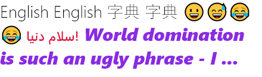


## PDF

With skia you can create PDF documents and draw anything on them, from text to images. The example below demonstrates how to create an PDF document and draw an SVG inside it:

```pascal
var
  LCanvas: ISkCanvas;
  LDocument: ISkDocument;
  LDOM: ISkSVGDOM;
  LPDFStream: TStream;
  LSize: TSizeF;
  LSVGStream: TStream;
begin
  LSVGStream := TFileStream.Create('Assets\Samples\lion.svg', fmOpenRead or fmShareDenyWrite);
  try
    LDOM := TSkSVGDOM.Make(LSVGStream);
  finally
    LSVGStream.Free;
  end;
  LSize := TSizeF.Create(600, 600);
  LDOM.SetContainerSize(LSize);

  LPDFStream := TFileStream.Create('output.pdf', fmCreate);
  try
    LDocument := TSkPDFDocument.Create(LPDFStream);
    try
      LCanvas := LDocument.BeginPage(LSize.Width, LSize.Height);
      try
        LDOM.Render(LCanvas);
      finally
        LDocument.EndPage;
      end;
    finally
      LDocument.Close;
    end;
  finally
    LPDFStream.Free;
  end;
end;
```

The example above with **Assets/Samples/lion.svg** SVG file results in the output below:


# WebP

WebP is a modern image format that provides superior lossless and lossy compression for images. WebP lossless images are 26% smaller in size compared to PNGs. WebP lossy images are 25-34% smaller than comparable JPEG images at equivalent quality.

The example below demonstrates how to encoder to WebP format:

```pascal
var
  LImage: ISkImage;
begin
  LImage := TSkImage.MakeFromEncoded(TFile.ReadAllBytes('Assets\Samples\kung_fu_panda.png'));
  TFile.WriteAllBytes('output.webp', LImage.EncodeToBytes(TSkEncodedImageFormat.WEBP, 80));
  TFile.WriteAllBytes('output.jpg', LImage.EncodeToBytes(TSkEncodedImageFormat.JPEG, 80));
end;
```

This code results in the output below:


| Format             | Size    |
|--------------------|---------|
| Png (100% quality) | 512 KB  |
| Jpeg (80% quality) | 65.1 KB |
| WebP (80% quality) | 51.6 KB |


## Controls

Some controls that help implement skia in your VCL or FMX app:

### PaintBox

TSkPaintBox is the ideal control for painting directly on the canvas with the event OnDraw:

```pascal
procedure TForm1.SkPaintBox1Draw(ASender: TObject; const ACanvas: ISkCanvas;
  const ADest: TRectF; const AOpacity: Single);
var
  LPaint: ISkPaint;
begin
  LPaint := TSkPaint.Create;
  LPaint.setShader(TSkShader.MakeGradientSweep(ADest.CenterPoint,
    [$FFFCE68D, $FFF7CAA5, $FF2EBBC1, $FFFCE68D]));
  ACanvas.DrawPaint(LPaint);
end;
```

The example above results in the output below:


Note: The TSkPaintBox has a drawing caching system. To force a drawing refresh, call TSkPaintBox.Redraw.


### SVG

TSkSvg is the control to load and display svgs easily:

```pascal
var
  LSvg: TSkSvg;
begin
  LSvg := TSkSvg.Create(Self);
  LSvg.Svg.Source := TFile.ReadAllText('Assets\Samples\gorilla.svg');
  LSvg.Parent := Self;
end;
```

The **Assets/Samples/gorilla.svg** svg file results in the output below:


Read more details in the [svg documentation](./Documents/SVG.md).


### Lottie (animation player)

Lottie files are vector animations in json format exported from Adobe After Effects. Like SVG, Lottie file is also a small file but capable of producing high quality animations.
The example below demonstrates how to play lottie files using our TSkLottieAnimation:


```pascal
var
  LLottie: TSkLottieAnimation;
begin
  LLottie := TSkLottieAnimation.Create(Self);
  LLottie.LoadFromFile('Assets\Samples\rocket.json');
  LLottie.Parent := Self;
end;
```

The **Assets/Samples/rocket.json** file animation results in the output below:


We also improved TSkLottieAnimation to support **Telegram stickers** (tgs files). Read more about this and other details in the [lottie documentation](./Documents/LOTTIE.md).


## TBitmap integration

It is possible to edit TBitmap (VCL or FMX) with Skia's Canvas using the code below:

```pascal  
var
  LBitmap: TBitmap;
begin
  LBitmap := TBitmap.Create(100, 100);
  try
    LBitmap.SkiaDraw(
      procedure (const ACanvas: ISkCanvas)
      begin
        // Draw with skia canvas...
      end);
```

It is possible to convert an TBimap do ISkImage too, when you need to draw an TBitmap inside an skia draw, using ```LBitmap.ToSkImage```


## Debug

The **TSkDebug.DebugMessageProc** global property defines the procedure that intercepts messages sent by Skia's **SkDebugf**. By compiling the Skia library in Debug mode it will be possible to detect bugs easily.


## Limitations

 - Unsupported platforms: iOS32, iOSSimulator and OSX32
 - Delphi 10.3 Rio or older, supports only windows platform
 - No support available for versions prior to Delphi XE6
 - [SVG limitations](./Documents/SVG.md#limitations)


## Version

**Skia4Delphi Version 2.0.1**

Skia Version used: [chrome/m88](https://github.com/google/skia/tree/chrome/m88)
What has changed from the original code? [Compare.](https://github.com/google/skia/compare/chrome/m88...viniciusfbb:main)
