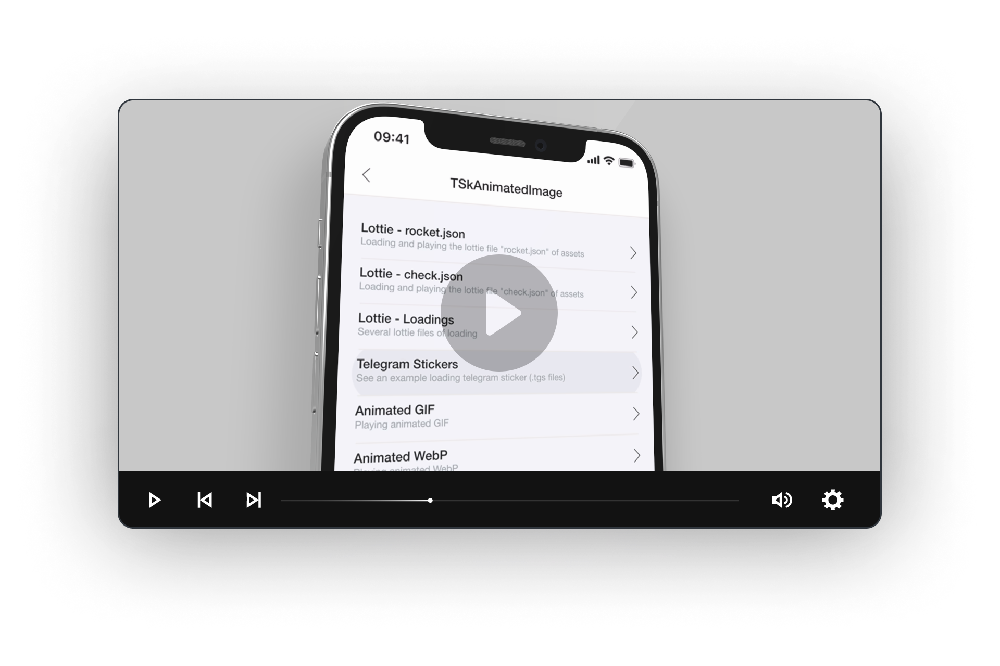
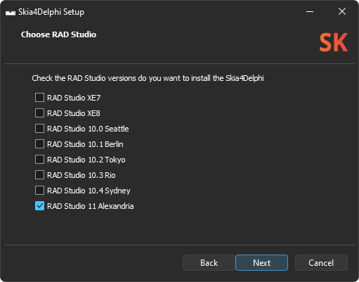
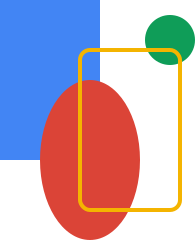
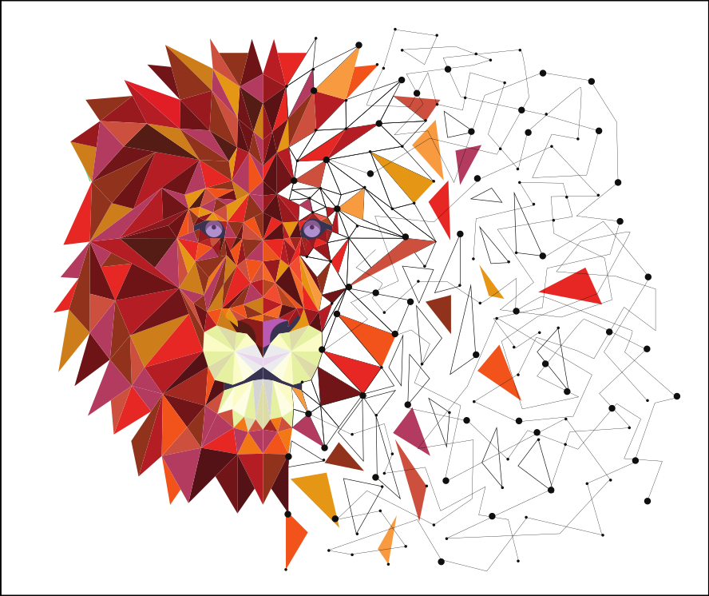
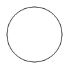
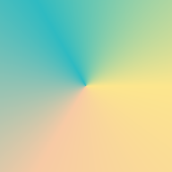

<p><a href="https://www.skia4delphi.org"></a></p>

<p>
  <a href="#compatibility"></a>
  <a href="#compatibility"></a>
  <a href="#compatibility"></a>
  <a href="https://t.me/skia4delphi"></a>
</p>

  

#  

**[Skia4Delphi](https://skia4delphi.org)** is a cross-platform 2D graphics API for Delphi based on [Google's Skia](https://skia.org/) graphics library.

<p><a href="https://www.youtube.com/watch?v=hI8L4qBXTgk&list=PLs0VGibu9RJZ8eQ_oJqfZx2jBwNT5wddU"></a></p>

  

## About
Skia is a great open source library for drawing 2D Text, Geometries, Images, focused on accurate, high quality and high performance rendering, which provides common APIs that work across a variety of hardware and software platforms.

Google's Skia Graphics Library serves as the graphics engine for Google Chrome and Chrome OS, Android, Flutter, Xamarin, Mozilla Firefox and Firefox OS, and many other products.

  

## Features

- Canvas 2D and Text Layout;
- CPU software rasterization;
- GPU-accelerated rendering;
- Right-to-Left rendering;
- SVG rendering and creation;
- PDF output;
- Runtime effects;
- Shading language;
- Shaders, mask and color filters;
- Image and path effects;
- Animated image player; (Lottie, GIF, WebP)
- Image codecs; (bmp, gif, ico, jpg, png, wbmp, webp and raw images)
- Particles; (provides a way to quickly generate large numbers of drawing primitives with dynamic, animated behavior)
  **and much more...**

  

## FMX graphics engine replacement

Using the **Skia4Delphi** library it is possible to override Firemonkey's rendering engine so that it can use Skia as its default Canvas. With that, your Firemonkey application will automatically:

- Draw with antialiasing on any platform (the drawing quality is based on the Form.Quality property);
- Increase the overall graphics performance of your application by up to 50% (even drawing with higher quality);
- Resize images with better quality (also based on Form.Quality);
- Support Right-To-Left text rendering;
- Fix dozens of inconsistencies in drawings (especially in corners and strokes, such as dashes, and in texts with special emojis);
- Increase the performance of the library in general ([controls](#controls-vclfmx), drawings, among others...).

[Learn more...](#fmx-canvas)

  

# Summary

* [Using the library](#using-the-library)
  * [Prerequisites](#prerequisites)
    * [Install](#install)
    * [Enable Skia](#enable-skia)
  * [Examples](#examples)
    * [Basic usage](#basic-usage)
    * [Text Right-to-Left](#text-right-to-left)
    * [Custom fonts](#custom-fonts)
    * [PDF](#pdf)
    * [Codecs](#codecs)
* [Integration with Delphi](#integration-with-delphi)
  * [Bitmap](#bitmap)
  * [Image formats](#image-formats)
  * [FMX Canvas](#fmx-canvas)
    * [Enable Canvas](#enable-canvas)
    * [Benchmark](#benchmark)
    * [Surface](#surface)
    * [Controls](#controls)
    * [Right-to-Left](#right-to-left)
* [Controls VCL/FMX](#controls-vclfmx)
  * [TSkAnimatedImage](#tskanimatedimage)
  * [TSkLabel](#tsklabel)
  * [TSkPaintBox](#tskpaintbox)
  * [TSkSvg](#tsksvg)
    * [Limitations](Documents/SVG.md#limitations)
* [Compatibility](#compatibility)
* [Documentation](#documentation)
* [Version](#version)

  

# Using the library

## Prerequisites

### Install

You can install **Skia4Delphi** in 3 ways:

- Setup (recommended)

  Download the setup of [latest release](../../releases/latest) and install it.

  

  

- Embarcadero's GetIt *(RAD Studio > Tools > GetIt Package Manager...)*

  <p></p>
  <p></p>

  

- Chocolatey package manager
  
  ```batch
  choco install skia4delphi
  ```

  

#### Remarks

1. Manual installation is possible, although it is not recommended; [Learn more...](Documents/INSTALLATION.md)
2. The pre-built Skia binaries were included in the source, but you can easily recompile them; [Learn more...](Documents/BUILD.md)
3. The pre-built Skia binary for **Linux64** targets was compiled for Debian (eg Ubuntu) and Red Hat (eg CentOS) based systems. If you want another distro you will need to [rebuild;](Documents/BUILD.md)
4. For Red Hat based systems you must replace the `Binary/Linux64/Release/libsk4d.so` file with the `Binary/Linux64/Release/Other Distributions/Red Hat/libsk4d.so` file.

  

### Enable Skia

After install the **Skia4Delphi**, just right click in your application project and click **Enable Skia**.


#### Tip

To improve the quality and performance of FMX drawings, replace the FMX graphics engine with the **Skia4Delphi** graphic engine. [Learn more...](#fmx-canvas)

  

## Examples

In this section you will find some examples of using **Skia4Delphi**, it works in **Console**, **FMX**, and **VCL** applications.
The code below is common code among all the examples in this section:

```pascal
uses
  Skia;

type
  TSkDrawExampleProc = reference to procedure(const ACanvas: ISkCanvas; const ADest: TRectF);

procedure DrawExample(const AWidth, AHeight: Integer; const ADrawProc: TSkDrawExampleProc);
var
  LSurface: ISkSurface;
begin
  LSurface := TSkSurface.MakeRaster(AWidth, AHeight);
  LSurface.Canvas.Clear(TAlphaColors.Null);
  ADrawProc(LSurface.Canvas, RectF(0, 0, AWidth, AHeight));
  LSurface.MakeImageSnapshot.EncodeToFile('output.png');
end;
```

  

### Basic usage

The code below demonstrate how to draw shapes:

```pascal
DrawExample(256, 256,
  procedure (const ACanvas: ISkCanvas; const ADest: TRectF)
  var
    LOval: ISkRoundRect;
    LPaint: ISkPaint;
    LRect: TRectF;
  begin
    LPaint := TSkPaint.Create;
    LPaint.AntiAlias := True;

    LPaint.Color := $FF4285F4;
    LRect := TRectF.Create(PointF(10, 10), 100, 160);
    ACanvas.DrawRect(LRect, LPaint);

    LOval := TSkRoundRect.Create;
    LOval.SetOval(LRect);
    LOval.Offset(40, 80);
    LPaint.Color := $FFDB4437;
    ACanvas.DrawRoundRect(LOval, LPaint);

    LPaint.Color := $FF0F9D58;
    ACanvas.DrawCircle(180, 50, 25, LPaint);

    LRect.Offset(80, 50);
    LPaint.Color := $FFF4B400;
    LPaint.Style := TSkPaintStyle.Stroke;
    LPaint.StrokeWidth := 4;
    ACanvas.DrawRoundRect(LRect, 10, 10, LPaint);
  end);
```

This code results in the output below:

<p></p>

[Learn more...](Documents/USAGE.md#basic-usage)  

  

### Text Right-to-Left

There are a couple of languages that the direction of the text is from right to left such as Persian, Arabic, Hebrew, and more. With **Skia4Delphi** it is possible to render Right-to-Left. The example below demonstrates how to render a Persian sentence using a text-shaping engine:

```pascal
DrawExample(256, 256,
  procedure (const ACanvas: ISkCanvas; const ADest: TRectF)
  var
    LBlob: ISkTextBlob;
    LFont: ISkFont;
    LPaint: ISkPaint;
    LShaper: ISkShaper;
  begin
    LFont := TSkFont.Create(TSkTypeface.MakeDefault, 55, 1);
    LShaper := TSkShaper.Create;
    LBlob := LShaper.Shape('سلام دنیا!', LFont, False, High(Integer));

    LPaint := TSkPaint.Create;
    LPaint.AntiAlias := True;
    LPaint.Color := TAlphaColors.Tomato;

    ACanvas.DrawTextBlob(LBlob, 0, 0, LPaint);
  end);
```

This code results in the output below:

<p></p>

  

### Custom fonts

With **Skia4Delphi** it is possible to use custom fonts easily, from the file, without the need to install it on the operating system, regardless of the platform. The example below will draw using two custom fonts:

```pascal
DrawExample(256, 256,
  procedure (const ACanvas: ISkCanvas; const ADest: TRectF)
  var
    LFont: ISkFont;
    LPaint: ISkPaint;
  begin
    LFont := TSkFont.Create(TSkTypeface.MakeFromFile('Assets\Samples\nunito-extrabold.ttf'), 23);
    LPaint := TSkPaint.Create;
    LPaint.Shader := TSkShader.MakeGradientLinear(PointF(0, 0), PointF(256, 145), $FFFF5F5F, $FF5B8DFE, TSkTileMode.Clamp);

    ACanvas.DrawSimpleText('"Each dream that you', 2, 25, LFont, LPaint);
    ACanvas.DrawSimpleText('leave behind is a part', 2, 55, LFont, LPaint);
    ACanvas.DrawSimpleText('of your future that will', 2, 85, LFont, LPaint);
    ACanvas.DrawSimpleText('no longer exist."', 2, 115, LFont, LPaint);

    LFont := TSkFont.Create(TSkTypeface.MakeFromFile('Assets\Samples\bonheur-royale-regular.ttf'), 28);
    LPaint.Shader := nil;
    LPaint.Color  := $FF5B8DFE;
    ACanvas.DrawSimpleText('(Steve Jobs)', 2, 150, LFont, LPaint);
  end);
```
This code results in the output below:

<p></p>

  

### PDF

With **Skia4Delphi** it is possible to create PDF documents and draw anything on them, from text to images. The example below demonstrates how to create an PDF document and draw an SVG inside it:

```pascal
var
  LCanvas: ISkCanvas;
  LDocument: ISkDocument;
  LDocumentStream: TStream;
  LSVGDOM: ISkSVGDOM;
  LSize: TSizeF;
begin
  LSVGDOM := TSkSVGDOM.MakeFromFile('Assets\Samples\lion.svg');
  LSize := TSizeF.Create(600, 600);
  LSVGDOM.SetContainerSize(LSize);

  LDocumentStream := TFileStream.Create('output.pdf', fmCreate);
  try
    LDocument := TSkDocument.MakePDF(LDocumentStream);
    try
      LCanvas := LDocument.BeginPage(LSize.Width, LSize.Height);
      try
        LSVGDOM.Render(LCanvas);
      finally
        LDocument.EndPage;
      end;
    finally
      LDocument.Close;
    end;
  finally
    LDocumentStream.Free;
  end;
end;
```

This code results in the output below:

<p></p>

  

### Codecs

The **Skia4Delphi** library supports many image formats. See below the list:

- Supported formats for decoding

  | Image Format                   | Extensions  |
  |--------------------------------|-------------|
  | Bitmap                         | .bmp        |
  | GIF                            | .gif        |
  | Icon                           | .ico        |
  | JPEG                           | .jpg, .jpeg |
  | PNG                            | .png        |
  | Raw Adobe DNG Digital Negative | .dng        |
  | Raw Canon                      | .cr2        |
  | Raw Fujifilm RAF               | .raf        |
  | Raw Nikon                      | .nef, .nrw  |
  | Raw Olympus ORF                | .orf        |
  | Raw Panasonic                  | .rw2        |
  | Raw Pentax PEF                 | .pef        |
  | Raw Samsung SRW                | .srw        |
  | Raw Sony                       | .arw        |
  | WBMP                           | .wbmp       |
  | WebP                           | .webp       |

- Supported formats for encoding

  | Image Format | Extensions  |
  |--------------|-------------|
  | JPEG         | .jpg, .jpeg |
  | PNG          | .png        |
  | WebP         | .webp       |

  

#### About WebP

WebP is a modern image format that provides superior lossless and lossy compression for images. WebP lossless images are 26% smaller in size compared to PNGs. WebP lossy images are 25-34% smaller than comparable JPEG images at equivalent quality.

The example below demonstrates how to encoder to WebP format:

```pascal
var
  LImage: ISkImage;
begin
  LImage := TSkImage.MakeFromEncodedFile('Assets\Samples\kung-fu-panda.png');
  LImage.EncodeToFile('output.webp', TSkEncodedImageFormat.WEBP, 80);
  LImage.EncodeToFile('output.jpg', TSkEncodedImageFormat.JPEG, 80);
end;
```

This code results in the output below:

<p></p>

| Format             | Size    |
|--------------------|---------|
| Png (100% quality) |  512 KB |
| Jpeg (80% quality) |   65 KB |
| WebP (80% quality) |   51 KB |

  

# Integration with Delphi

## Bitmap

It is possible to edit TBitmap (**VCL** or **FMX**) with Skia's Canvas using the code below:

```pascal  
var
  LBitmap: TBitmap;
begin
  LBitmap := TBitmap.Create(100, 100);
  try
    LBitmap.SkiaDraw(
      procedure (const ACanvas: ISkCanvas)
      begin
        // Draw with Skia canvas...
      end);
```

  

## Image formats

The library registers the following codecs:

* **VCL**: .svg, .webp, .wbmp and raw images (.arw, .cr2, .dng, .nef, .nrw, .orf, .raf, .rw2, .pef and .srw).

  

* **FMX**: .bmp, .gif, .ico, .webp, .wbmp and raw images (.arw, .cr2, .dng, .nef, .nrw, .orf, .raf, .rw2, .pef and .srw).

As a result, any Delphi control, such as a TImage, can normally load these new formats.

  

## FMX Canvas

It is possible to replace the default Canvas from FMX to Skia based Canvas. Once this feature is enabled, all FMX controls will be painted using Skia4Delphi automatically. With that it is possible to improve the quality and performance of the drawings for the FMX as well as for the whole library.

  

### Enable Canvas

Open the source of your Delphi Application Project *(.dpr)*, include the `Skia.FMX` unit  **after** the `FMX.Forms` unit, and set the `GlobalUseSkia` to **True**, as in the example below:

```pascal
uses
  System.StartUpCopy,
  FMX.Forms,
  Skia.FMX,
  Unit1 in 'Unit1.pas' {Form1};

{$R *.res}

begin
  GlobalUseSkia := True;
  Application.Initialize;
  ...
```

  

#### Remarks

1. `Skia.FMX` unit must be included after the `FMX.Forms`;
2. The **Metal** implementation is experimental, but can be used by including the `FMX.Types` unit **after** the `FMX.Forms` unit, and setting `GlobalUseMetal` to **True** together with `GlobalUseSkia`;
3. `GlobalUseSkia` has no effect on Linux. (although not supported, all [controls](#controls-vclfmx) work perfectly)
4. This declaration of `GlobalUseSkia := True;`, as well as other variables of FMX itself, such as `GlobalUseMetal`, can also be made in the initialization of some unit instead of .dpr. Sometimes this is really necessary because if in the initialization or in the class constructor of some unit, bitmaps are used, the GlobalUseXXX declarations of the .dpr will have no effect. In this case, just create a unit in the project like "Project.Startup.pas", place the GlobalUseXXX declarations in the initialization of this new unit, and declare this new unit before any other unit of yours in the .dpr, that is, right after FMX.Forms.

  

### Benchmark

The performance test is a simulation of a real application, with hundreds of controls, to measure the FPS rate when sliding a vertical scroll.

| Device                                | Platform    | FMX    | Skia     |
| ------------------------------------- | ----------- | -----: | -------: |
| Motorola Moto 3rd Generation          | Android     | 25 fps | 38 fps   |
| LG K40s                               | Android     | 30 fps | 47 fps   |
| Samsung Galaxy A01 Core               | Android     | 20 fps | 26 fps   |
| Samsung Galaxy S7 Edge                | Android64   | 53 fps | 56 fps   |
| Samsung Galaxy S8 Plus                | Android64   | 50 fps | 55 fps   |
| Apple iPhone 11                       | iOSDevice64 | 59 fps | 60 fps   |
| Apple iPhone 12                       | iOSDevice64 | 59 fps | 59 fps   |
| Apple MacBook Air Model A2337         | OSXARM64    | 58 fps | 30 fps * |
| Intel Core i7-8565U / Radeon 520      | Win32       | 82 fps | 92 fps   |
| Intel Core i7-8565U / Radeon 520      | Win64       | 83 fps | 91 fps   |
| Intel Core i7-4500U / GeForce GT 720M | Win32       | 85 fps | 92 fps   |
| Intel Core i7-4500U / GeForce GT 720M | Win64       | 86 fps | 93 fps   |

  

#### Metal

| Device                          | Platform    | FMX    | Skia   |
| ------------------------------- | ----------- | -----: | -----: |
| Apple iPhone 11                 | iOSDevice64 | 59 fps | 60 fps |
| Apple iPhone 12                 | iOSDevice64 | 59 fps | 59 fps |
| Apple MacBook Air Model A2337   | OSXARM64    | 60 fps | 60 fps |

  

#### Remarks

1. Delphi's `TGPUCanvas` (default Canvas used on cell phones, as well as Apple computers when Metal is enabled) does not use anti-aliasing (anti-aliasing is a technique that improves the quality of diagonal lines) while Skia uses it. That is, Skia has better performance and quality in the drawings than default FMX Canvas.
    
    | FMX circle                                     | Skia circle                                      |
    | ---------------------------------------------- | ------------------------------------------------ |
    |  |  |
    
2. Firemonkey uses Quartz on macOS, and for **Skia4Delphi** use OpenGL it would be necessary to edit the Delphi runtime library, so we choose to keep the rasterization method and not implement OpenGL on macOS. In the future it is likely that we will set Metal as default, as OpenGL is deprecated in Apple's operating systems. For those who want to use the Skia Canvas on macOS we recommend enabling Metal.

3. Tests made from virtual machines are inconsistent with reality.

  

### Surface

Using Skia's Canvas, during the Scene of a Bitmap or Control (between the `BeginScene` and `EndScene` calls), it is possible to access the `Surface` property as follows:

```pascal
uses
  Skia,
  Skia.FMX.Graphics;

var
  LBitmap: TBitmap;
  LCanvas: ISkCanvas;
begin
  LBitmap := TBitmap.Create(300, 300);
  try
    if LBitmap.Canvas.BeginScene then
    begin
      try
        LCanvas := TSkCanvasCustom(LBitmap.Canvas).Surface.Canvas;
        // Draw with LCanvas...
      finally
        LBitmap.Canvas.EndScene;
      end;
    end;
  finally
    LBitmap.Free;
  end;
end;
```

  

#### Remarks

1. `Surface` property will only be available during Scene (between the `BeginScene` and `EndScene` calls);
2. Canvas for UI (created from a window *eg rectangles, circles, objects inherited from TControl*) must draw exclusively from the **main thread**, while Canvas created from `TBitmap` are **thread safe**.

  

#### Tip

If your app has background threads that do a lot of bitmap drawings, be aware that it is safe to remove the global lock from the `TCanvas` base class when Skia based Canvas is enabled, to allow your app to do truly parallel drawings, gaining a lot of performance. For that, it is necessary to make a patch in the units `FMX.Graphics.pas` and `FMX.TextLayout.pas`. [Learn more](https://quality.embarcadero.com/browse/RSP-37232)

  

### Controls

Using Skia's Canvas, it is possible to access the Surface property from the `Paint` procedure of a control, to draw directly using Skia, as shown below:

```pascal
unit Unit1;

interface

uses
  FMX.Controls,
  FMX.Graphics,
  Skia,
  Skia.FMX.Graphics;


type
  TControl1 = class(TControl)
  protected
    procedure Paint; override;
  end;

implementation

{ TControl1 }

procedure TControl1.Paint;
var
  LCanvas: ISkCanvas;
begin
  LCanvas := TSkCanvasCustom(Canvas).Surface.Canvas;
  // Draw with LCanvas...
end;
```

  

### Right-to-Left

Using Skia's Canvas, your application will now support Right-To-Left text rendering. But for that you will need to make 3 changes to your project:

  1. Open the source of your Delphi Application Project *(.dpr)*, include the line `Application.BiDiMode := TBiDiMode.bdRightToLeft;`, like below:
  ```pascal
  program Project1;
  
  uses
    System.StartUpCopy,
    FMX.Forms,
    System.Classes,
    Skia.FMX,
    Unit1 in 'Unit1.pas' {Form1};
  
  {$R *.res}
  
  begin
    Application.BiDiMode := TBiDiMode.bdRightToLeft;
    GlobalUseSkia := True;
    Application.Initialize;
    Application.CreateForm(TForm1, Form1);
    Application.Run;
  end.
  ```
  2. Set the property `BiDiMode` of your forms to `bdRightToLeft`;
  3. Keyboard input controls like TEdit and TMemo, need to be fixed by Embarcadero, meanwhile, as a workaround, set the `ControlType` property of these controls to `Platform`.

  

# Controls VCL/FMX

## TSkAnimatedImage

**TSkAnimatedImage** is the control that can load and render animated images, including vector animations, in a very simple way. The supported formats are:

| Format           | Extensions     |
|------------------|----------------|
| Lottie file      | .json, .lottie |
| Telegram Sticker | .tgs           |
| Animated GIF     | .gif           |
| Animated WebP    | .webp          |

  

The example below demonstrates how to play lottie files using **TSkAnimatedImage**:

```pascal
var
  LAnimatedImage: TSkAnimatedImage;
begin
  LAnimatedimage := TSkAnimatedImage.Create(Self);
  LAnimatedimage.LoadFromFile('Assets\Samples\rocket.json');
  LAnimatedimage.Parent := Self;
end;
```

The example above results in the output below:


[Learn more...](Documents/ANIMATED-IMAGES.md#TSkAnimatedImage)

  

## TSkLabel

**TSkLabel** is the control that implements the SkParagraph internally, having several more features than the TLabel, such as:

 - Font families; (font fallback list like in css)
 - Font weight;
 - Font slant;
 - Support for multiple styles in text;
 - Support for BiDi; (Right-to-Left)
 - Support justify horizontal alignment;
 - Support custom font; (without install the font)
 - Supports background color on parts of the text;
 - Limit the maximum number of lines;
 - Auto size option; (width and height)
 - Advanced decorations; (like underline wavy, overline, dashed line, among others...)
   **and much more...**


[Learn more...](Documents/LABEL.md#tsklabel)

  

## TSkPaintBox

**TSkPaintBox** is the ideal control for painting with skia api directly on the canvas with the event `OnDraw`:

```pascal
procedure TForm1.SkPaintBox1Draw(ASender: TObject; const ACanvas: ISkCanvas;
  const ADest: TRectF; const AOpacity: Single);
var
  LPaint: ISkPaint;
begin
  LPaint := TSkPaint.Create;
  LPaint.Shader := TSkShader.MakeGradientSweep(ADest.CenterPoint,
    [$FFFCE68D, $FFF7CAA5, $FF2EBBC1, $FFFCE68D]);
  ACanvas.DrawPaint(LPaint);
end;
```

The example above results in the output below:



*Note: The TSkPaintBox has a drawing caching system. To force a drawing refresh, call TSkPaintBox.Redraw. However, this cache system does not exist in FMX apps that have enabled [Skia4Delphi graphic engine](#fmx-canvas) for optimization reasons.*

  

## TSkSvg

**TSkSvg** is the control to load and display SVG easily:

```pascal
var
  LSvg: TSkSvg;
begin
  LSvg := TSkSvg.Create(Self);
  LSvg.Svg.Source := TFile.ReadAllText('Assets\Samples\gorilla.svg');
  LSvg.Parent := Self;
end;
```

The example above results in the output below:

<p></p>

[Learn more...](Documents/SVG.md)

  

# Compatibility

| RAD Studio                   | Platforms        |
|------------------------------|------------------|
| RAD Studio 11 Alexandria   | All Platforms    |
| RAD Studio 10.3 Rio or newer | Windows, Android |
| RAD Studio XE7 or newer      | Windows          |

For the platforms supported by **Skia4Delphi** (listed above), the OS versions supported by the library are the same [OS versions that RAD Studio supports.](https://docwiki.embarcadero.com/PlatformStatus/en/Main_Page)

## Remarks

1. The pre-built Skia binary for **Linux64** targets was compiled for Debian (eg Ubuntu) and Red Hat (eg CentOS) based systems. If you want another distro you will need to [rebuild;](Documents/BUILD.md)
2. For Red Hat based systems you must replace the `Binary/Linux64/Release/libsk4d.so` file with the `Binary/Linux64/Release/Other Distributions/Red Hat/libsk4d.so` file.

  

# Documentation

The APIs are very similar to Skia's, few methods and functions have been renamed for readability, so the [Skia documentation](https://skia.org/docs) can be used.

  

# Version

**[Skia4Delphi 3.4.0](/../../releases/latest)**

Skia Version used: [chrome/m98](https://github.com/google/skia/tree/chrome/m98)
What has changed from the original code? [Compare.](https://github.com/google/skia/compare/chrome/m98...skia4delphi:main)

#  

Help us responding a small questionnaire about our users in [this link](https://c7hppqdug11.typeform.com/to/Qc6o3ELs)
